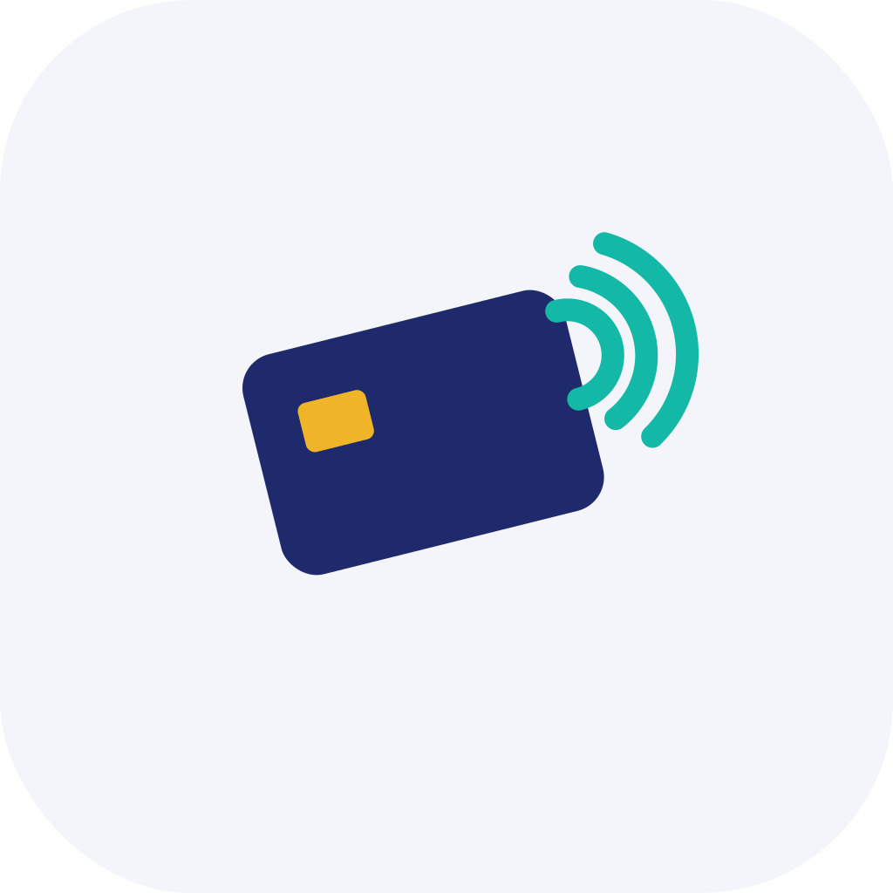

<p align="center">
  
</p>

<h1 align="center">nfc-keyboard-emulator</h1>

<p align="center">
  Turn a contactless card reader into a keyboard.
</p>

<p align="center">
  
  
  
  
  
  
</p>

---

**nfc-keyboard-emulator** is a small cross-platform desktop app that bridges a PC/SC
NFC/contactless reader to your keyboard. Place a card on the reader and the app reads
its UID and types it straight into whatever input field is focused — a software
"keyboard wedge" for readers that don't emulate a keyboard themselves. Everything runs
locally: no cloud, no telemetry, no account.

## Why

Many NFC readers (e.g. the ACS ACR122U) expose cards over the PC/SC smartcard API
rather than acting as a USB keyboard. That makes them unusable in plain web forms or
apps that simply expect typed input. This tool fills that gap: pick your reader, and
every scanned card UID is entered for you — exactly as if you had typed it.

## Features

- **Works with any PC/SC reader** — ACR122U and other CCID / 13.56 MHz readers on macOS and Windows.
- **Types the UID into the focused field** — with a configurable trailing key (Enter, Tab, or none).
- **Pick your scanner** — live device list with hot-plug detection.
- **Safety toggle** — typing is armed/disarmed with one click, so you never type by accident.
- **Live scan log** — every scan with timestamp, reader, UID and status; export to CSV.
- **Configurable output** — upper/lower case, separators, byte order, prefix; live preview.
- **Tray + autostart** — closes to the system tray; optional launch on login.
- **Local only** — no network access; the card UID never leaves your machine.

## Supported hardware

13.56 MHz contactless readers exposed via PC/SC (CCID). Verified with the **ACS
ACR122U**. The UID is read with the standard `FF CA 00 00 00` APDU; the app never
writes to cards. (125 kHz / proximity-only readers are not supported.)

## Install

### macOS

Download the `.dmg` from the [latest release](../../releases/latest), open it and drag
the app into Applications. Signed builds are notarized and open directly; an unsigned
build may need a one-time right-click → **Open**.

**Accessibility permission:** to type into other apps, macOS requires Accessibility
access. Open **System Settings → Privacy & Security → Accessibility** and enable
**nfc-keyboard-emulator**. The app shows a banner with a shortcut button if the
permission is missing.

### Windows

Download the `.msi` / `.exe` from the [latest release](../../releases/latest). While
the binary is unsigned, SmartScreen shows a warning — choose **More info → Run anyway**.

## Usage

1. Select your reader from the dropdown (**Refresh** rescans for hot-plugged devices).
2. Click **Typing active** to arm typing.
3. Place a card on the reader — its UID is typed into the focused field.
4. Tune the output format (case, separator, byte order, prefix, trailing key) — the
   preview updates live.
5. Watch the **scan log** and **Export CSV** if you need a record.
6. Closing the window hides it to the tray; **Quit** from the tray menu exits.

## Build from source

Prerequisites: [Rust](https://rustup.rs) (stable) and [Node.js](https://nodejs.org) 20+.

```bash
npm ci
npm run tauri build     # bundles into src-tauri/target/release/bundle/
# or run it live:
npm run tauri dev
```

## Development

```bash
npm test                # frontend unit tests (vitest)
cd src-tauri && cargo test && cargo clippy -- -D warnings && cargo fmt --check
```

A hardware smoke test (needs a reader + a 13.56 MHz card) is available behind a flag:

```bash
NFC_HW_TEST=1 cargo test --manifest-path src-tauri/Cargo.toml reader_pcsc::hw_tests -- --ignored --nocapture
```

See [CONTRIBUTING.md](CONTRIBUTING.md) for the manual pre-release checklist and commit
conventions.

## License

[MIT](LICENSE) © 2026 NoiXdev
